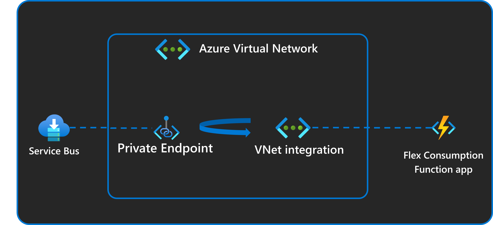

# Azure Functions PowerShell Service Bus Trigger using Azure Developer CLI

This template repository contains a Service Bus trigger reference sample for functions written in PowerShell and deployed to Azure using the Azure Developer CLI (`azd`). The sample uses managed identity and a virtual network to make sure deployment is secure by default. This sample demonstrates these two key features of the Flex Consumption plan:

* **High scale**. A low concurrency of 1 is configured for the function app in the `host.json` file. Once messages are loaded into Service Bus and the app is started, you can see how it scales to one app instance per message simultaneously.
* **Virtual network integration**. The Service Bus that this Flex Consumption app reads events from is secured behind a private endpoint. The function app can read events from it because it is configured with VNet integration. All connections to Service Bus and to the storage account associated with the Flex Consumption app also use managed identity connections instead of connection strings.



This project is designed to run on your local computer. You can also use GitHub Codespaces if available.

This sample processes queue-based events, demonstrating a common Azure Functions scenario where batch processing jobs are queued up with instructions for processing. The function app processes each message with a simulated delay to showcase the scaling capabilities.

> [!IMPORTANT]
> This sample creates several resources. Make sure to delete the resource group after testing to minimize charges!

## Prerequisites

* [PowerShell 7.4+](https://learn.microsoft.com/powershell/scripting/install/installing-powershell)
* [Azure Functions Core Tools](https://learn.microsoft.com/azure/azure-functions/functions-run-local?tabs=v4%2Clinux%2Cpowershell%2Cportal%2Cbash#install-the-azure-functions-core-tools)
* To use Visual Studio Code to run and debug locally:
  * [Visual Studio Code](https://code.visualstudio.com/)
  * [Azure Functions extension](https://marketplace.visualstudio.com/items?itemName=ms-azuretools.vscode-azurefunctions)
  * [PowerShell extension](https://marketplace.visualstudio.com/items?itemName=ms-vscode.PowerShell)
* [Azure CLI](https://learn.microsoft.com/cli/azure/install-azure-cli) (for deployment)
* [Azure Developer CLI](https://learn.microsoft.com/azure/developer/azure-developer-cli/install-azd?tabs=winget-windows%2Cbrew-mac%2Cscript-linux&pivots=os-windows)
* An Azure subscription with Microsoft.Web and Microsoft.App [registered resource providers](https://learn.microsoft.com/azure/azure-resource-manager/management/resource-providers-and-types#register-resource-provider)

## Initialize the local project

You can initialize a project from this `azd` template in one of these ways:

* Use this `azd init` command from an empty local (root) folder:

    ```shell
    azd init --template functions-quickstart-powershell-azd-service-bus
    ```

    Supply an environment name, such as `flexquickstart` when prompted. In `azd`, the environment is used to maintain a unique deployment context for your app.

* Clone the GitHub template repository locally using the `git clone` command:

    ```shell
    git clone https://github.com/Azure-Samples/functions-quickstart-powershell-azd-service-bus.git
    cd functions-quickstart-powershell-azd-service-bus
    ```

    You can also clone the repository from your own fork in GitHub.

## Provision Azure resources

1. Run the following command to provision all required Azure resources:

    ```shell
    azd provision
    ```

    You're prompted to supply these required deployment parameters:

    | Parameter | Description |
    | ---- | ---- |
    | _Environment name_ | An environment that's used to maintain a unique deployment context for your app. You won't be prompted if you created the local project using `azd init`. |
    | _Azure subscription_ | Subscription in which your resources are created. |
    | _Azure location_ | Azure region in which to create the resource group that contains the new Azure resources. Only regions that currently support the Flex Consumption plan are shown. |
    | _VNET_ENABLED_ | Whether to deploy with VNet integration and private endpoints. Enter `false` unless you need private networking. |

    This creates all necessary Azure resources including:
    * Azure Service Bus namespace and queue
    * Azure Function App (Flex Consumption)
    * Application Insights for monitoring
    * Storage account for function app
    * Virtual network with private endpoints (if `VNET_ENABLED=true`)

    After provisioning completes, a post-provision script automatically generates `src/local.settings.json` with the correct Service Bus connection settings:

    ```json
    {
      "IsEncrypted": false,
      "Values": {
        "AzureWebJobsStorage": "UseDevelopmentStorage=true",
        "FUNCTIONS_WORKER_RUNTIME": "powershell",
        "ServiceBusConnection__fullyQualifiedNamespace": "<your-namespace>.servicebus.windows.net",
        "ServiceBusQueueName": "<your-queue-name>"
      }
    }
    ```

## Prepare local dependencies

No extra build step is required for the PowerShell sample.

## Run your app locally

1. Start the Azurite storage emulator. You can do this using the [Azurite extension](https://marketplace.visualstudio.com/items?itemName=Azurite.azurite) in VS Code or by running `azurite` in a separate terminal.

1. From the `src` folder, run this command to start the Functions host locally:

    ```shell
    cd src
    func start
    ```

1. The function starts and displays the available functions. You should see output similar to:

    ```output
    Functions:
        serviceBusQueueTrigger: serviceBusTrigger
    ```

1. When you're done, press Ctrl+C in the terminal window to stop the `func` host process.

## Run your app using Visual Studio Code

1. Open the project root folder in Visual Studio Code.
1. Start the Azurite storage emulator.
1. Press **Run/Debug (F5)** to run in the debugger.
1. The Azure Functions extension starts the local runtime.

## Source Code

The Service Bus trigger function is defined in [`src/serviceBusQueueTrigger/run.ps1`](./src/serviceBusQueueTrigger/run.ps1) with its binding configuration in [`src/serviceBusQueueTrigger/function.json`](./src/serviceBusQueueTrigger/function.json). The trigger concurrency setting is in [`src/host.json`](./src/host.json).

## Deploy to Azure

Run this command to deploy your function app code to Azure:

```shell
azd deploy
```

## Test the solution

1. With the function running (either locally or deployed to Azure), send a test message to the Service Bus queue by running the generated script:

    ```shell
    ./send-message.sh
    ```

    On Windows (PowerShell):

    ```powershell
    .\send-message.ps1
    ```

1. You should see output in the function terminal similar to:

    ```output
    [2026-01-01T10:30:15.123Z] PowerShell ServiceBus Queue trigger start processing a message: Hello from the CLI
    [2026-01-01T10:30:45.123Z] PowerShell ServiceBus Queue trigger end processing a message
    ```

1. To observe scaling behavior in Azure, deploy first, then send multiple messages and check Application Insights live metrics.

## Redeploy your code

Run `azd deploy` to deploy code updates. If you need to update infrastructure, run `azd provision` again.

> [!NOTE]
> Deployed code files are always overwritten by the latest deployment package.

## Clean up resources

When you're done working with your function app and related resources, you can use this command to delete the function app and its related resources from Azure and avoid incurring any further costs:

```shell
azd down
```

## Resources

For more information on Azure Functions, Service Bus, and VNet integration, see the following resources:

* [Azure Functions documentation](https://docs.microsoft.com/azure/azure-functions/)
* [Azure Service Bus documentation](https://docs.microsoft.com/azure/service-bus/)
* [Azure Virtual Network documentation](https://docs.microsoft.com/azure/virtual-network/)
